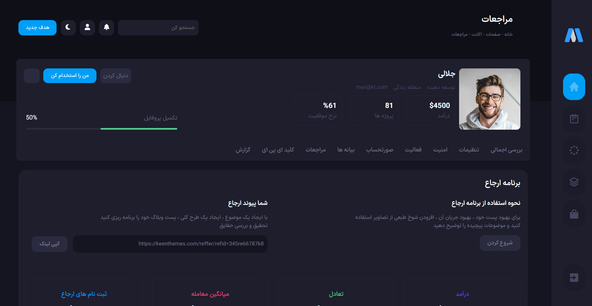

# Welcome to the Admin Panel!
---
## Features:

- **Beautiful Interface:** Explore a visually appealing design.
- **Static Data Display:** Check out static data and sample content.
- **Mock User Management:** Interact with simulated user management features.

This is a development preview, and only frontend features have been implemented. Enjoy exploring the aesthetics and layout while anticipating the dynamic functionality to come in future updates! ❤ 

## preview
 
## Library and tools used in it:
> [Bootstrap](https://getbootstrap.com/)   
> [Tippy.js](https://tippyjs.bootcss.com/)   
> [Apexcharts.js](https://apexcharts.com/)   
> [Swiper.js](https://swiperjs.com/)   

## Trello link:
>[ This is our team's Trollo link](https://trello.com/invite/b/vmQGBPfV/ATTIa0495ce0937f7d8489ad7b8329e96e57ABB5F047/admin-panel)  
> The pages we hit :
[Report](https://metronictheme.job100.ir/rtl/metronic8/demo9/dist/account/logs.html) - [api](https://metronictheme.job100.ir/rtl/metronic8/demo9/dist/account/api-keys.html) - [referrals](https://metronictheme.job100.ir/rtl/metronic8/demo9/dist/account/referrals.html ) - [statements](https://metronictheme.job100.ir/rtl/metronic8/demo9/dist/account/statements.html) -[ security](https://metronictheme.job100.ir/rtl/metronic8/demo9/dist/account/security.html) 
> [This is the main site](https://metronictheme.job100.ir/rtl/metronic8/demo9/dist/account/statements.html)   

 ### team members: 
 - Marjan khourmayipour
 - Mahsa Arabzadeh
 - MohammadReza Rezayi
 - Tara Tavangar 
TODO : add this page : https://metronictheme.job100.ir/rtl/metronic8/demo9/dist/
